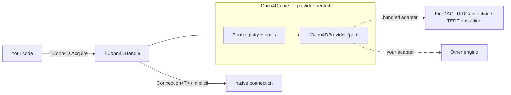
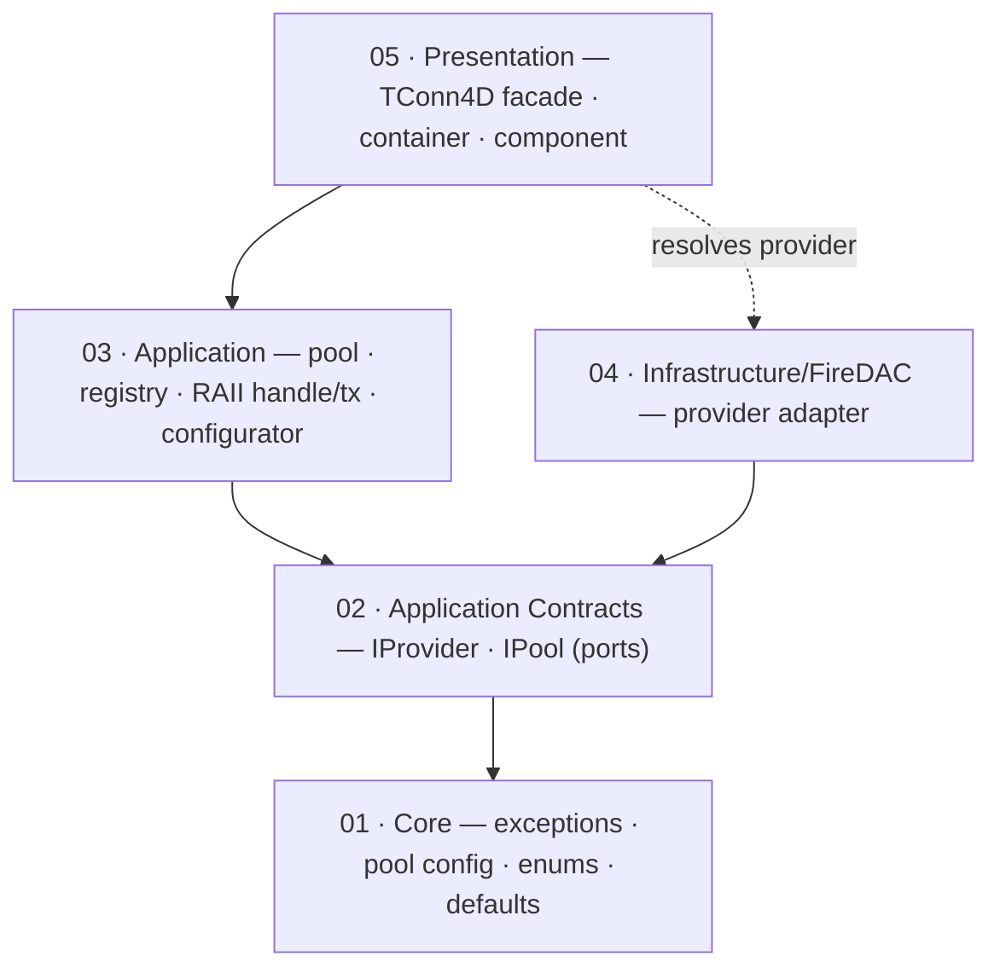

<div align="center">

# Conn4D

**Provider-neutral connection management for Delphi 12** — named connection pools, RAII connection/transaction handles, automatic background sweep, and a one-line fluent configurator. FireDAC adapter bundled.

[](LICENSE)
[](https://www.embarcadero.com/products/delphi)
[](https://github.com/HashLoad/boss)
[](CHANGELOG.md)
[](tests/Conn4D.Tests)

[English](README.md) · [Português (BR)](README.pt-BR.md)

</div>

> **Conn4D is a connection library. It does not execute SQL.** Query execution, parameter binding and result-set mapping are deliberately out of scope — you run SQL through your own `TFDQuery` bound to the connection/transaction handles Conn4D hands out (or pair it with a builder like **Query4D**).

---

## Table of Contents

- [Why Conn4D?](#why-conn4d)
- [Features](#features)
- [Installation](#installation)
- [Quick Start](#quick-start)
- [Configuring Pools](#configuring-pools)
- [Acquiring a Connection](#acquiring-a-connection)
- [Transactions](#transactions)
- [Pool Policy & Defaults](#pool-policy--defaults)
- [Provider-Neutral Design](#provider-neutral-design)
- [Public API Surface](#public-api-surface)
- [Out of Scope](#out-of-scope)
- [Architecture](#architecture)
- [Roadmap](#roadmap)
- [Documentation](#documentation)
- [Contributing](#contributing)
- [License](#license)

---

## Why Conn4D?

Hand-rolled connection handling in Delphi tends to drift into the same traps: a single shared `TFDConnection` that serializes every request, connections leaked because a `finally` was forgotten, transactions left open after an early `Exit`, and driver-specific code (`TFDConnection`, `TFDTransaction`) smeared across the whole application.

**Conn4D** solves these with three ideas:

1. **Named pools.** Register a pool once with a fluent builder; borrow connections by name. The pool reuses idle, healthy connections and caps concurrency at `MaxPoolSize`.
2. **RAII handles.** `TConn4DHandle` and `TConn4DTransaction` are **value-type records** backed by a reference-counted guard. When the handle leaves scope, the connection returns to the pool automatically; a transaction with no explicit `Commit` is rolled back — no leaks, even on exceptions.
3. **Provider neutrality.** Your code depends on Conn4D handles, not on FireDAC types. The FireDAC adapter is the bundled implementation, swappable by implementing one interface.

## Features

- **Fluent configurator** — `TConn4D.Configure.Pool('name')…Apply` registers a pool in one chain; chain `.Pool('another')` to define several.
- **Named connection pools** — lazy creation, idle reuse, `MaxPoolSize` cap, `AcquireTimeout` back-pressure.
- **RAII connection handle** (`TConn4DHandle`) — returns the connection to the pool on scope exit; implicit-converts to `TFDConnection`.
- **RAII transaction handle** (`TConn4DTransaction`) — explicit `Commit`/`Rollback`, **auto-rollback on abandon**, implicit-converts to `TFDTransaction`.
- **Background sweep** — idle/unhealthy connections are reclaimed automatically; `Sweep` can also be triggered manually.
- **Provider-neutral core** — zero FireDAC in the public surface except the convenience implicit operators; add engines by implementing `IConn4DProvider`.
- **Sensible defaults** — Firebird-friendly out of the box, fully overridable per pool.
- **Non-visual `TConn4D` component** for the `ORData` palette.
- **DUnitX test suite** — pooling, reuse, exhaustion/timeout, sweep, concurrency, transaction lifecycle, and optional real-Firebird integration tests.

## Installation

[Boss](https://github.com/HashLoad/boss) is the easiest path:

```bash
boss install github.com/gabrielcb08/conn4d@v0.3.0-alpha.1
```

Runtime dependencies (installed by Boss):

- [`Spring4D`](https://bitbucket.org/sglienke/spring4d) — used internally to resolve providers.
- [`DUnitX`](https://github.com/VSoftTechnologies/DUnitX) — test framework (test-time only).

A single unit reference unlocks the whole public API:

```delphi
uses
  Conn4D,                 // TConn4D, TConn4DHandle, TConn4DTransaction, configurator, exceptions
  FireDAC.Comp.Client;    // your TFDQuery / TFDConnection
```

> See [docs/BOSS.md](docs/BOSS.md) for the full Boss workflow.

## Quick Start

```delphi
uses
  Conn4D,
  FireDAC.Comp.Client;

var
  Conn : TConn4DHandle;
  Qry  : TFDQuery;
begin
  // 1) Configure a pool once (e.g. at startup)
  TConn4D.Configure
    .Pool('default')
      .Host('127.0.0.1')
      .Port(3050)
      .Database('C:\Data\APP.FDB')
      .UserName('SYSDBA')
      .Password('masterkey')
      .DriverID('FB')
    .Apply;

  // 2) Borrow a connection (RAII — returned to the pool when Conn leaves scope)
  Conn := TConn4D.Acquire;            // default pool

  Qry := TFDQuery.Create(nil);
  try
    Qry.Connection := Conn;           // implicit conversion to TFDConnection
    Qry.SQL.Text := 'select current_date from rdb$database';
    Qry.Open;
    Writeln(Qry.Fields[0].AsString);
  finally
    Qry.Free;
  end;
end;  // Conn out of scope → connection returned to the pool
```

See [samples/BasicUsage](samples/BasicUsage), [samples/AdvancedUsage](samples/AdvancedUsage) and [samples/FormUsage](samples/FormUsage) for runnable demos.

---

## Configuring Pools

`TConn4D.Configure` returns a fluent configurator. Each `.Pool(name)` opens a builder; `.Apply` validates and registers it. Define several pools by chaining `.Pool(...)` again — the previous pool is applied automatically.

```delphi
TConn4D.Configure
  .Pool('default')
    .Host('127.0.0.1')
    .Port(3050)
    .Database('C:\Data\APP.FDB')
    .UserName('SYSDBA')
    .Password('masterkey')
    .DriverID('FB')
    .MaxPoolSize(10)
    .AcquireTimeout(5000)     // ms to wait for a free slot
    .IdleTimeout(300000)      // ms before an idle connection is swept
    .SweepInterval(60000)     // ms between background sweeps
    .AddParam('Protocol', 'TCPIP')
  .Pool('reports')            // applies 'default', starts a new pool
    .Database('C:\Data\REPORTS.FDB')
    .UserName('SYSDBA')
    .Password('masterkey')
  .Apply;                     // applies 'reports'
```

`Apply` raises `EConn4DConfigException` if a required field is missing (`PoolName`, `Database`, `DriverID`, `MaxPoolSize > 0`, `AcquireTimeout > 0`). Unset numeric options fall back to the [defaults](#pool-policy--defaults).

---

## Acquiring a Connection

`TConn4D.Acquire` returns a `TConn4DHandle` — a value-type RAII record:

```delphi
var Conn := TConn4D.Acquire;            // default pool ('default')
var Conn := TConn4D.Acquire('reports'); // named pool
```

Three ways to reach the underlying connection:

```delphi
Qry.Connection := Conn;                          // 1) implicit → TFDConnection
var FD := Conn.Connection<TFDConnection>;        // 2) explicit generic cast
if Conn.IsValid then ShowMessage(Conn.PoolName); // 3) introspection
```

The lease is reference-counted: copying the handle extends the lease; when the **last** copy goes out of scope the connection is returned to the pool. Never cache the raw `TFDConnection` beyond the handle's lifetime.

If every slot is busy and none frees within `AcquireTimeout`, `Acquire` raises `EConn4DPoolExhaustedException`. Acquiring from an unknown pool raises `EConn4DPoolNotFoundException`.

---

## Transactions

Open a transaction on a leased connection with `BeginTransaction`. The returned `TConn4DTransaction` is also RAII:

```delphi
uses
  Conn4D,
  FireDAC.Comp.Client;

var
  Conn : TConn4DHandle;
  Tx   : TConn4DTransaction;
  Qry  : TFDQuery;
begin
  Conn := TConn4D.Acquire('default');
  Tx   := Conn.BeginTransaction;

  Qry := TFDQuery.Create(nil);
  try
    Qry.Connection  := Conn;     // implicit → TFDConnection
    Qry.Transaction := Tx;       // implicit → TFDTransaction
    Qry.SQL.Text := 'UPDATE produtos SET descricao = :d WHERE id = :id';
    Qry.ParamByName('d').AsString  := 'NEW';
    Qry.ParamByName('id').AsInteger := 42;
    Qry.ExecSQL;

    Tx.Commit;                   // commit on success
  finally
    Qry.Free;
  end;
end;  // if Commit was never called, the guard auto-rolls back (tsAbandoned)
```

Transaction lifecycle (`TConn4DTxState`):

| State | Meaning |
| ----- | ------- |
| `tsActive` | Open; `Commit`/`Rollback` allowed |
| `tsCommitted` | `Commit` succeeded — terminal |
| `tsRolledBack` | `Rollback` called explicitly — terminal |
| `tsAbandoned` | Went out of scope still active → **auto-rolled back** |

- `Rollback` is **idempotent** — a second call is a no-op.
- `Commit` after a rollback/commit raises `EConn4DTransactionException`.
- `IsActive` / `State` let you introspect before acting.

---

## Pool Policy & Defaults

Defaults are Firebird-friendly and overridable per pool (`TConn4DDefaults`):

| Setting | Default | Notes |
| ------- | ------- | ----- |
| Pool name | `default` | Used by the parameterless `Acquire` / `Configure.Pool` |
| `DriverID` | `FB` | FireDAC driver id |
| `Port` | `3050` | Applied when left at `0` |
| `MaxPoolSize` | `10` | Hard cap on concurrent leased connections |
| `AcquireTimeout` | `5000` ms | Wait before `EConn4DPoolExhaustedException` |
| `IdleTimeout` | `300000` ms | Idle window before a connection is swept |
| `SweepInterval` | `60000` ms | Cadence of the background sweeper |

A background sweeper reclaims idle-too-long and unhealthy connections. Trigger it manually with `TConn4D.Sweep('pool')` (or `TConn4D.Sweep` for all pools) — it returns the number of connections reclaimed. Call `TConn4D.Shutdown` on application exit to stop the sweeper and destroy all pools.

---

## Provider-Neutral Design

The public API hands out **neutral handles**, not FireDAC objects. The only place FireDAC appears in the surface is the convenience implicit operators (`TConn4DHandle → TFDConnection`, `TConn4DTransaction → TFDTransaction`); the pool, registry, configurator and transaction logic are all FireDAC-free and talk only to `IConn4DProvider` / `IConn4DNativeConnection` / `IConn4DNativeTransaction`.

The **FireDAC adapter is bundled and auto-registered** on first use (via `TConn4DContainer`, backed by Spring4D — you never touch it directly). To target another engine, implement `IConn4DProvider` and register it:

```delphi
TConn4D.RegisterProvider(TMyEngineProvider.Create);
```



`Connection<T>` / `Transaction<T>` raise `EConn4DCastException` when the native object is `nil` or of the wrong type — a clear failure mode if a future provider is wired into the same code path. The default transaction options are Firebird-specific; override per pool via `AddParam` when targeting another driver.

---

## Public API Surface

| Symbol | Kind | Purpose |
| ------ | ---- | ------- |
| `TConn4D` | static class (facade) | `Configure`, `Acquire`, `PoolExists`, `Sweep`, `Shutdown`, `RegisterProvider` |
| `TConn4DConfigurator` / `TConn4DPoolBuilder` | fluent builders | Declare and register pools |
| `TConn4DHandle` | RAII record | Leased connection; `Connection<T>`, `BeginTransaction`, `PoolName`, `IsValid` |
| `TConn4DTransaction` | RAII record | `Commit`, `Rollback`, `Transaction<T>`, `IsActive`, `State` |
| `TConn4DContainer` | static class | Spring4D bootstrap for provider resolution (internal/optional) |
| `EConn4D*` | exceptions | `EConn4DConfigException`, `EConn4DPoolNotFoundException`, `EConn4DPoolExhaustedException`, `EConn4DCastException`, `EConn4DTransactionException`, `EConn4DProviderException` |

---

## Out of Scope

The following are intentionally **not** part of Conn4D and belong in a layer built on top of it:

- SQL execution helpers (`Execute`, `Query`, `Scalar`);
- Result-set readers / row mappers;
- Parameter-binding APIs;
- ORM / repository / unit-of-work abstractions.

A consuming package — for instance, **Query4D** for fluent SQL building — is the right place for those concerns. Inside Conn4D, the only surface that accepts SQL is your own `TFDQuery` bound to a handle.

---

## Architecture

Conn4D is built on **Clean Architecture** (the dependency rule + Ports & Adapters) — *not* DDD. Connection pooling is a technical, supporting concern with no business domain, so the innermost layer is **Core** (primitive types, policy defaults, and the `TConn4DPoolConfig` Value Object), not an Evans-style "Domain".

```
src/
├─ 01 - Core/                  ← exceptions, pool config Value Object, enums + defaults
├─ 02 - Application Contracts/ ← provider-neutral ports (IProvider, IPool)
├─ 03 - Application/           ← pool, registry, RAII handle/transaction, fluent configurator
├─ 04 - Infrastructure/FireDAC/← the bundled IConn4DProvider adapter
└─ 05 - Presentation/          ← TConn4D facade, container, TConn4D component
```



Full layer breakdown, component table, and the acquire / transaction / sweep sequence diagrams are in **[docs/ARCHITECTURE.md](docs/ARCHITECTURE.md)**.

---

## Roadmap

- [ ] Additional bundled providers (e.g. a generic `dbExpress`/`Zeos` adapter).
- [ ] Per-pool health-check query customization.
- [ ] Observability hooks (acquire/release/sweep callbacks) for metrics.
- [ ] Win64 + cross-platform verified builds (CI matrix).

Open an issue to discuss design before contributing one of these.

---

## Documentation

| Document | What's inside |
| -------- | ------------- |
| [docs/ARCHITECTURE.md](docs/ARCHITECTURE.md) | Layering, components, acquire/transaction/sweep flows, diagrams |
| [docs/TESTING.md](docs/TESTING.md) | Test layout, how to run, Firebird integration env vars |
| [docs/CONTRIBUTING.md](docs/CONTRIBUTING.md) | Coding standards, PR checklist, adding a provider |
| [docs/BOSS.md](docs/BOSS.md) | Boss install, release workflow |
| [docs/CHANGELOG.md](docs/CHANGELOG.md) | Version-by-version change log |
| [docs/REFACTOR-0.2.0.md](docs/REFACTOR-0.2.0.md) | Historical note on the SQL-execution removal |

---

## Contributing

Contributions are welcome. Before sending a PR:

1. Read [docs/CONTRIBUTING.md](docs/CONTRIBUTING.md).
2. Add DUnitX tests for behavioral changes.
3. Preserve layer boundaries — the public surface stays provider-neutral; FireDAC code lives only under `04 - Infrastructure/FireDAC/`.
4. Update [docs/CHANGELOG.md](docs/CHANGELOG.md).

The Firebird integration tests are skipped unless these environment variables are set:

```
CONN4D_FIREBIRD_DATABASE
CONN4D_FIREBIRD_HOST
CONN4D_FIREBIRD_PORT
CONN4D_FIREBIRD_USER
CONN4D_FIREBIRD_PASSWORD
```

---

## License

Released under the [MIT License](LICENSE) — free for commercial and personal use.
