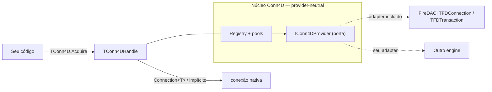
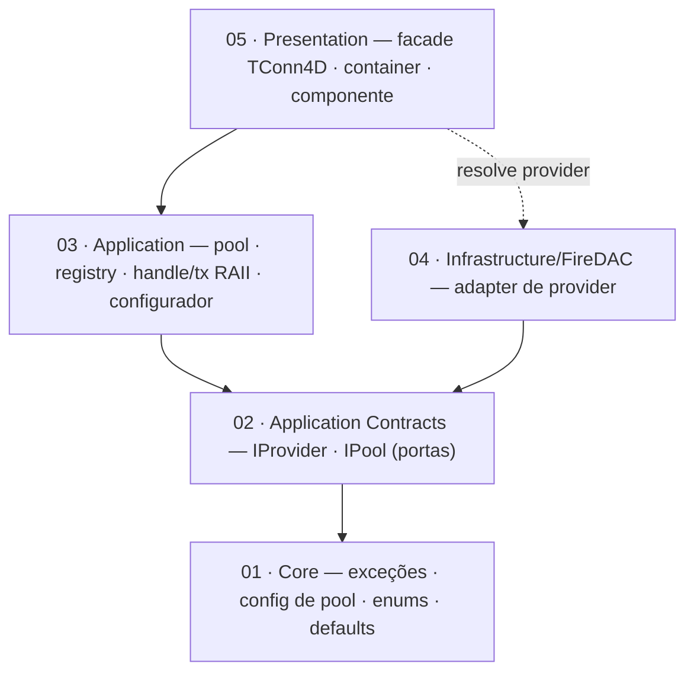

<div align="center">

# Conn4D

**Gestão de conexões provider-neutral para Delphi 12** — pools de conexão nomeados, handles RAII de conexão/transação, sweep automático em segundo plano e um configurador fluente de uma linha. Adapter FireDAC incluído.

[](LICENSE)
[](https://www.embarcadero.com/products/delphi)
[](https://github.com/HashLoad/boss)
[](CHANGELOG.md)
[](tests/Conn4D.Tests)

[English](README.md) · [Português (BR)](README.pt-BR.md)

</div>

> **Conn4D é uma biblioteca de conexão. Ela não executa SQL.** Execução de queries, bind de parâmetros e mapeamento de result-set ficam deliberadamente fora de escopo — você roda SQL pelo seu próprio `TFDQuery` ligado aos handles de conexão/transação que o Conn4D entrega (ou combine com um builder como o **Query4D**).

---

## Índice

- [Por que Conn4D?](#por-que-conn4d)
- [Recursos](#recursos)
- [Instalação](#instalação)
- [Início rápido](#início-rápido)
- [Configurando pools](#configurando-pools)
- [Adquirindo uma conexão](#adquirindo-uma-conexão)
- [Transações](#transações)
- [Política de pool e defaults](#política-de-pool-e-defaults)
- [Design provider-neutral](#design-provider-neutral)
- [Superfície da API pública](#superfície-da-api-pública)
- [Fora de escopo](#fora-de-escopo)
- [Arquitetura](#arquitetura)
- [Roadmap](#roadmap)
- [Documentação](#documentação)
- [Como contribuir](#como-contribuir)
- [Licença](#licença)

---

## Por que Conn4D?

Gestão de conexão feita à mão no Delphi costuma cair nas mesmas armadilhas: um único `TFDConnection` compartilhado que serializa toda requisição, conexões vazadas porque esqueceram um `finally`, transações deixadas abertas após um `Exit` antecipado e código específico de driver (`TFDConnection`, `TFDTransaction`) espalhado pela aplicação inteira.

O **Conn4D** resolve isso com três ideias:

1. **Pools nomeados.** Registre um pool uma vez com um builder fluente; pegue conexões por nome. O pool reaproveita conexões ociosas e saudáveis e limita a concorrência em `MaxPoolSize`.
2. **Handles RAII.** `TConn4DHandle` e `TConn4DTransaction` são **records value-type** sustentados por um guard com contagem de referência. Quando o handle sai de escopo, a conexão volta ao pool automaticamente; uma transação sem `Commit` explícito sofre rollback — sem vazamentos, mesmo com exceção.
3. **Neutralidade de provider.** Seu código depende dos handles do Conn4D, não de tipos FireDAC. O adapter FireDAC é a implementação incluída, trocável implementando uma única interface.

## Recursos

- **Configurador fluente** — `TConn4D.Configure.Pool('nome')…Apply` registra um pool em uma cadeia; encadeie `.Pool('outro')` para definir vários.
- **Pools de conexão nomeados** — criação preguiçosa, reuso de ociosas, limite `MaxPoolSize`, back-pressure por `AcquireTimeout`.
- **Handle RAII de conexão** (`TConn4DHandle`) — devolve a conexão ao pool ao sair de escopo; conversão implícita para `TFDConnection`.
- **Handle RAII de transação** (`TConn4DTransaction`) — `Commit`/`Rollback` explícitos, **auto-rollback em abandono**, conversão implícita para `TFDTransaction`.
- **Sweep em segundo plano** — conexões ociosas/insalubres são recuperadas automaticamente; `Sweep` também pode ser disparado manualmente.
- **Núcleo provider-neutral** — zero FireDAC na superfície pública, exceto os operadores implícitos de conveniência; adicione engines implementando `IConn4DProvider`.
- **Defaults sensatos** — amigáveis a Firebird por padrão, totalmente sobrescrevíveis por pool.
- **Componente não-visual `TConn4D`** na paleta `ORData`.
- **Suíte DUnitX** — pooling, reuso, exaustão/timeout, sweep, concorrência, ciclo de vida de transação e testes opcionais de integração com Firebird real.

## Instalação

[Boss](https://github.com/HashLoad/boss) é o caminho mais fácil:

```bash
boss install github.com/gabrielcb08/conn4d@v0.3.0-alpha.1
```

Dependências de runtime (instaladas pelo Boss):

- [`Spring4D`](https://bitbucket.org/sglienke/spring4d) — usado internamente para resolver providers.
- [`DUnitX`](https://github.com/VSoftTechnologies/DUnitX) — framework de testes (só em tempo de teste).

Uma única referência de unit libera toda a API pública:

```delphi
uses
  Conn4D,                 // TConn4D, TConn4DHandle, TConn4DTransaction, configurador, exceções
  FireDAC.Comp.Client;    // seu TFDQuery / TFDConnection
```

> Veja [docs/BOSS.md](docs/BOSS.md) para o fluxo completo do Boss.

## Início rápido

```delphi
uses
  Conn4D,
  FireDAC.Comp.Client;

var
  Conn : TConn4DHandle;
  Qry  : TFDQuery;
begin
  // 1) Configure um pool uma vez (ex.: no startup)
  TConn4D.Configure
    .Pool('default')
      .Host('127.0.0.1')
      .Port(3050)
      .Database('C:\Data\APP.FDB')
      .UserName('SYSDBA')
      .Password('masterkey')
      .DriverID('FB')
    .Apply;

  // 2) Pegue uma conexão (RAII — devolvida ao pool quando Conn sai de escopo)
  Conn := TConn4D.Acquire;            // pool default

  Qry := TFDQuery.Create(nil);
  try
    Qry.Connection := Conn;           // conversão implícita para TFDConnection
    Qry.SQL.Text := 'select current_date from rdb$database';
    Qry.Open;
    Writeln(Qry.Fields[0].AsString);
  finally
    Qry.Free;
  end;
end;  // Conn sai de escopo → conexão devolvida ao pool
```

Veja [samples/BasicUsage](samples/BasicUsage), [samples/AdvancedUsage](samples/AdvancedUsage) e [samples/FormUsage](samples/FormUsage).

---

## Configurando pools

`TConn4D.Configure` devolve um configurador fluente. Cada `.Pool(nome)` abre um builder; `.Apply` valida e registra. Defina vários pools encadeando `.Pool(...)` de novo — o pool anterior é aplicado automaticamente.

```delphi
TConn4D.Configure
  .Pool('default')
    .Host('127.0.0.1')
    .Port(3050)
    .Database('C:\Data\APP.FDB')
    .UserName('SYSDBA')
    .Password('masterkey')
    .DriverID('FB')
    .MaxPoolSize(10)
    .AcquireTimeout(5000)     // ms de espera por um slot livre
    .IdleTimeout(300000)      // ms até uma conexão ociosa ser varrida
    .SweepInterval(60000)     // ms entre sweeps em background
    .AddParam('Protocol', 'TCPIP')
  .Pool('reports')            // aplica 'default', inicia novo pool
    .Database('C:\Data\REPORTS.FDB')
    .UserName('SYSDBA')
    .Password('masterkey')
  .Apply;                     // aplica 'reports'
```

`Apply` lança `EConn4DConfigException` se faltar campo obrigatório (`PoolName`, `Database`, `DriverID`, `MaxPoolSize > 0`, `AcquireTimeout > 0`). Opções numéricas não informadas usam os [defaults](#política-de-pool-e-defaults).

---

## Adquirindo uma conexão

`TConn4D.Acquire` devolve um `TConn4DHandle` — record RAII value-type:

```delphi
var Conn := TConn4D.Acquire;            // pool default ('default')
var Conn := TConn4D.Acquire('reports'); // pool nomeado
```

Três formas de alcançar a conexão subjacente:

```delphi
Qry.Connection := Conn;                          // 1) implícito → TFDConnection
var FD := Conn.Connection<TFDConnection>;        // 2) cast genérico explícito
if Conn.IsValid then ShowMessage(Conn.PoolName); // 3) introspecção
```

O lease é contado por referência: copiar o handle estende o lease; quando a **última** cópia sai de escopo, a conexão volta ao pool. Nunca cacheie o `TFDConnection` cru além do tempo de vida do handle.

Se todos os slots estão ocupados e nenhum libera dentro de `AcquireTimeout`, `Acquire` lança `EConn4DPoolExhaustedException`. Adquirir de um pool inexistente lança `EConn4DPoolNotFoundException`.

---

## Transações

Abra uma transação numa conexão emprestada com `BeginTransaction`. O `TConn4DTransaction` retornado também é RAII:

```delphi
uses
  Conn4D,
  FireDAC.Comp.Client;

var
  Conn : TConn4DHandle;
  Tx   : TConn4DTransaction;
  Qry  : TFDQuery;
begin
  Conn := TConn4D.Acquire('default');
  Tx   := Conn.BeginTransaction;

  Qry := TFDQuery.Create(nil);
  try
    Qry.Connection  := Conn;     // implícito → TFDConnection
    Qry.Transaction := Tx;       // implícito → TFDTransaction
    Qry.SQL.Text := 'UPDATE produtos SET descricao = :d WHERE id = :id';
    Qry.ParamByName('d').AsString  := 'NEW';
    Qry.ParamByName('id').AsInteger := 42;
    Qry.ExecSQL;

    Tx.Commit;                   // commit no sucesso
  finally
    Qry.Free;
  end;
end;  // se Commit nunca foi chamado, o guard faz auto-rollback (tsAbandoned)
```

Ciclo de vida da transação (`TConn4DTxState`):

| Estado | Significado |
| ------ | ----------- |
| `tsActive` | Aberta; `Commit`/`Rollback` permitidos |
| `tsCommitted` | `Commit` bem-sucedido — terminal |
| `tsRolledBack` | `Rollback` chamado explicitamente — terminal |
| `tsAbandoned` | Saiu de escopo ainda ativa → **auto-rollback** |

- `Rollback` é **idempotente** — a segunda chamada é no-op.
- `Commit` após rollback/commit lança `EConn4DTransactionException`.
- `IsActive` / `State` permitem introspecção antes de agir.

---

## Política de pool e defaults

Os defaults são amigáveis a Firebird e sobrescrevíveis por pool (`TConn4DDefaults`):

| Configuração | Default | Notas |
| ------------ | ------- | ----- |
| Nome do pool | `default` | Usado pelo `Acquire` / `Configure.Pool` sem parâmetro |
| `DriverID` | `FB` | Driver id do FireDAC |
| `Port` | `3050` | Aplicado quando deixado em `0` |
| `MaxPoolSize` | `10` | Limite rígido de conexões emprestadas simultâneas |
| `AcquireTimeout` | `5000` ms | Espera antes de `EConn4DPoolExhaustedException` |
| `IdleTimeout` | `300000` ms | Janela ociosa antes do sweep |
| `SweepInterval` | `60000` ms | Cadência do sweeper em background |

Um sweeper em segundo plano recupera conexões ociosas demais e insalubres. Dispare manualmente com `TConn4D.Sweep('pool')` (ou `TConn4D.Sweep` para todos) — retorna quantas conexões foram recuperadas. Chame `TConn4D.Shutdown` ao encerrar a aplicação para parar o sweeper e destruir todos os pools.

---

## Design provider-neutral

A API pública entrega **handles neutros**, não objetos FireDAC. O único ponto em que o FireDAC aparece na superfície são os operadores implícitos de conveniência (`TConn4DHandle → TFDConnection`, `TConn4DTransaction → TFDTransaction`); pool, registry, configurador e lógica de transação são livres de FireDAC e falam só com `IConn4DProvider` / `IConn4DNativeConnection` / `IConn4DNativeTransaction`.

O **adapter FireDAC é incluído e auto-registrado** no primeiro uso (via `TConn4DContainer`, apoiado em Spring4D — você nunca o toca diretamente). Para outro engine, implemente `IConn4DProvider` e registre:

```delphi
TConn4D.RegisterProvider(TMeuProvider.Create);
```



`Connection<T>` / `Transaction<T>` lançam `EConn4DCastException` quando o objeto nativo é `nil` ou do tipo errado. As opções de transação default são específicas de Firebird; sobrescreva por pool via `AddParam` ao mirar outro driver.

---

## Superfície da API pública

| Símbolo | Tipo | Propósito |
| ------- | ---- | --------- |
| `TConn4D` | classe estática (facade) | `Configure`, `Acquire`, `PoolExists`, `Sweep`, `Shutdown`, `RegisterProvider` |
| `TConn4DConfigurator` / `TConn4DPoolBuilder` | builders fluentes | Declara e registra pools |
| `TConn4DHandle` | record RAII | Conexão emprestada; `Connection<T>`, `BeginTransaction`, `PoolName`, `IsValid` |
| `TConn4DTransaction` | record RAII | `Commit`, `Rollback`, `Transaction<T>`, `IsActive`, `State` |
| `TConn4DContainer` | classe estática | Bootstrap Spring4D p/ resolução de providers (interno/opcional) |
| `EConn4D*` | exceções | `EConn4DConfigException`, `EConn4DPoolNotFoundException`, `EConn4DPoolExhaustedException`, `EConn4DCastException`, `EConn4DTransactionException`, `EConn4DProviderException` |

---

## Fora de escopo

Intencionalmente **fora** do Conn4D, pertencem a uma camada acima:

- Helpers de execução de SQL (`Execute`, `Query`, `Scalar`);
- Readers de result-set / mappers de linha;
- APIs de bind de parâmetros;
- Abstrações de ORM / repository / unit-of-work.

Um pacote consumidor — por exemplo o **Query4D** para montar SQL fluente — é o lugar certo para isso. Dentro do Conn4D, a única superfície que aceita SQL é o seu próprio `TFDQuery` ligado a um handle.

---

## Arquitetura

O Conn4D segue **Clean Architecture** (regra de dependência + Ports & Adapters) — *não* DDD. Pooling de conexão é uma preocupação técnica/de apoio, sem domínio de negócio; por isso a camada mais interna é **Core** (tipos primitivos, defaults de política e o Value Object `TConn4DPoolConfig`), e não um "Domain" no sentido de Eric Evans.

```
src/
├─ 01 - Core/                  ← exceções, config de pool (Value Object), enums + defaults
├─ 02 - Application Contracts/ ← portas provider-neutral (IProvider, IPool)
├─ 03 - Application/           ← pool, registry, handle/transação RAII, configurador fluente
├─ 04 - Infrastructure/FireDAC/← o adapter IConn4DProvider incluído
└─ 05 - Presentation/          ← facade TConn4D, container, componente TConn4D
```



Detalhamento completo de camadas, tabela de componentes e diagramas de sequência (acquire / transação / sweep) em **[docs/ARCHITECTURE.md](docs/ARCHITECTURE.md)**.

---

## Roadmap

- [ ] Providers adicionais incluídos (ex.: adapter genérico `dbExpress`/`Zeos`).
- [ ] Customização da query de health-check por pool.
- [ ] Hooks de observabilidade (callbacks de acquire/release/sweep) para métricas.
- [ ] Builds verificados em Win64 + multiplataforma (matriz de CI).

---

## Documentação

| Documento | Conteúdo |
| --------- | -------- |
| [docs/ARCHITECTURE.md](docs/ARCHITECTURE.md) | Camadas, componentes, fluxos acquire/transação/sweep, diagramas |
| [docs/TESTING.md](docs/TESTING.md) | Layout de testes, como rodar, env vars de integração Firebird |
| [docs/CONTRIBUTING.md](docs/CONTRIBUTING.md) | Padrões de código, checklist de PR, como adicionar um provider |
| [docs/BOSS.md](docs/BOSS.md) | Instalação Boss, fluxo de release |
| [docs/CHANGELOG.md](docs/CHANGELOG.md) | Histórico de versões |
| [docs/REFACTOR-0.2.0.md](docs/REFACTOR-0.2.0.md) | Nota histórica sobre a remoção da execução de SQL |

---

## Como contribuir

Contribuições são bem-vindas. Antes do PR:

1. Leia [docs/CONTRIBUTING.md](docs/CONTRIBUTING.md).
2. Adicione testes DUnitX para mudanças de comportamento.
3. Preserve as fronteiras de camada — a superfície pública continua provider-neutral; código FireDAC só em `04 - Infrastructure/FireDAC/`.
4. Atualize [docs/CHANGELOG.md](docs/CHANGELOG.md).

Os testes de integração com Firebird são pulados a menos que estas variáveis de ambiente estejam definidas:

```
CONN4D_FIREBIRD_DATABASE
CONN4D_FIREBIRD_HOST
CONN4D_FIREBIRD_PORT
CONN4D_FIREBIRD_USER
CONN4D_FIREBIRD_PASSWORD
```

---

## Licença

Sob a [licença MIT](LICENSE) — livre para uso comercial e pessoal.
