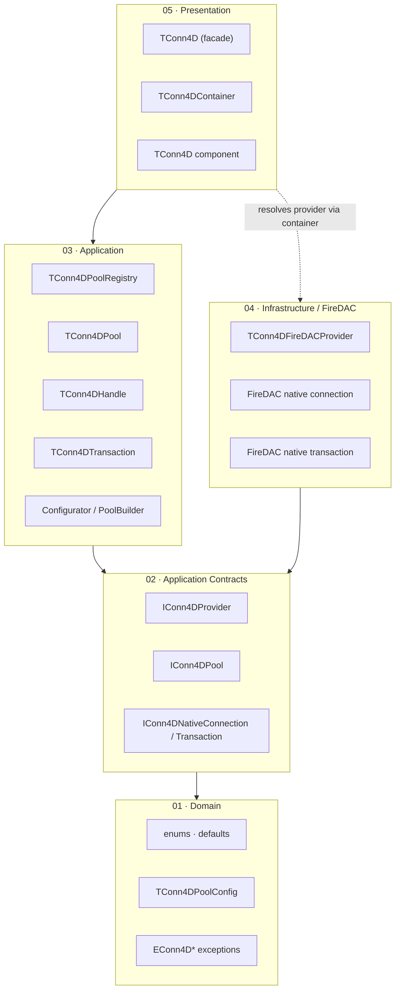
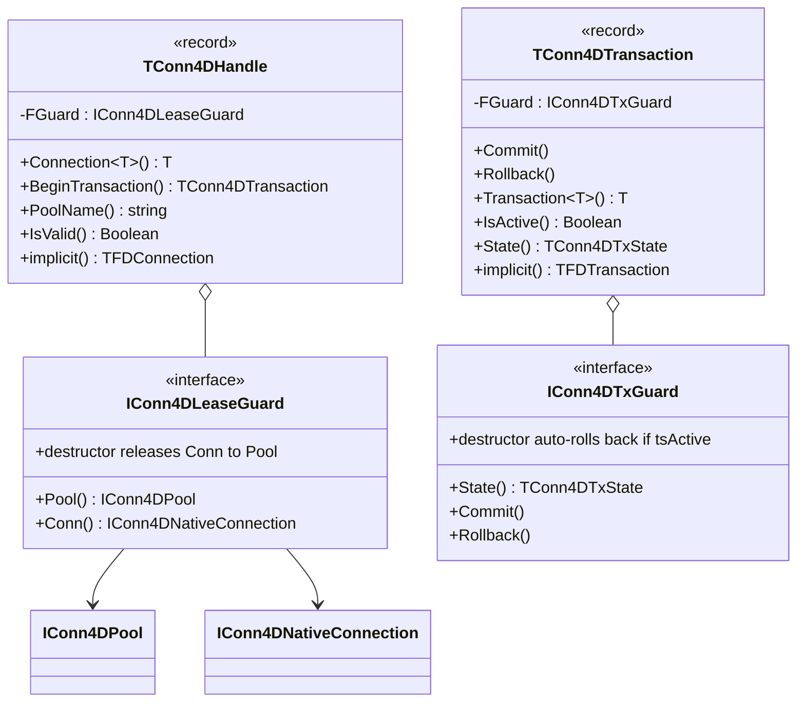
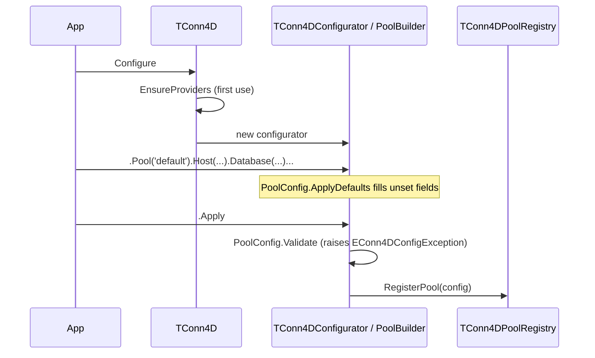
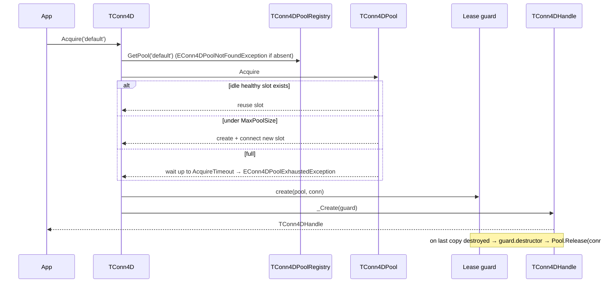

# Architecture

Conn4D is built on **Clean Architecture** with strict, inward-pointing dependency rules. This document covers the layering, the responsibility of each component, the RAII model, and the runtime flows for connection acquisition, transactions, and background sweeping.

> **At a glance:** consumers talk to a static facade (`TConn4D`) and two value-type RAII records (`TConn4DHandle`, `TConn4DTransaction`). Everything below the facade is provider-neutral and speaks only to interfaces; the one bundled adapter (FireDAC) lives in a single Infrastructure folder.

---

## Principles

- **Clean Architecture** — dependencies point inward (toward Domain and Application Contracts). No layer references a layer above it.
- **Provider-neutral core** — the public surface has **zero** FireDAC dependency except the convenience implicit operators on the two handle records. All pool, registry, configurator and transaction logic depends only on `IConn4DProvider` / `IConn4DNativeConnection` / `IConn4DNativeTransaction`.
- **RAII by default** — handles are **records** backed by reference-counted guards. The pool slot is released, and an uncommitted transaction is rolled back, automatically when the record leaves scope.
- **No SQL, no ORM** — Conn4D hands out connection/transaction handles; SQL execution belongs to a consumer layer (e.g. Query4D).
- **Spring4D is an internal detail** — `TConn4DContainer` uses it to resolve providers, with a hard-coded fallback to the bundled FireDAC provider. Consumers never interact with the container.

---

## Layering

```
src/
├─ 01 - Domain/                  ← pure types, no outward dependencies
│   ├─ Conn4D.Domain.Types        (TConn4DPoolState, TConn4DTxState, TConn4DDefaults)
│   ├─ Conn4D.Domain.PoolConfig   (TConn4DPoolConfig — ApplyDefaults / Validate)
│   └─ Conn4D.Domain.Exceptions   (EConn4D* hierarchy)
│
├─ 02 - Application Contracts/   ← provider-neutral ports
│   ├─ IProvider  (IConn4DProvider, IConn4DNativeConnection, IConn4DNativeTransaction)
│   └─ IPool      (IConn4DPool — internal pool contract)
│
├─ 03 - Application/             ← orchestration (FireDAC-free, except handle/tx operators)
│   ├─ Conn4D.Application.Pool          (thread-safe pool: lazy create, idle reuse, timeout)
│   ├─ Conn4D.Application.PoolRegistry  (singleton registry + background sweeper)
│   ├─ Conn4D.Application.Handle        (TConn4DHandle + lease guard)
│   ├─ Conn4D.Application.Transaction   (TConn4DTransaction + tx guard)
│   └─ Conn4D.Application.Configurator  (TConn4DConfigurator / TConn4DPoolBuilder)
│
├─ 04 - Infrastructure/FireDAC/  ← the bundled adapter
│   ├─ Conn4D.Infrastructure.FireDAC.Provider           (IConn4DProvider)
│   ├─ Conn4D.Infrastructure.FireDAC.ConnectionHandle   (IConn4DNativeConnection)
│   └─ Conn4D.Infrastructure.FireDAC.TransactionHandle  (IConn4DNativeTransaction)
│
└─ 05 - Presentation/            ← what consumers see
    ├─ Conn4D.Presentation.Facade   (TConn4D static class)
    ├─ Conn4D.Container             (TConn4DContainer — Spring4D bootstrap)
    └─ Components/                  (TConn4D non-visual component + Conn4D.Reg)
```

### Dependency rule



---

## Components

| Layer | Component | Responsibility |
| ----- | --------- | -------------- |
| Domain | `TConn4DPoolState` | Slot state enum (`psIdle`, `psAcquired`, `psUnhealthy`) |
| Domain | `TConn4DTxState` | `tsActive`, `tsCommitted`, `tsRolledBack`, `tsAbandoned` |
| Domain | `TConn4DDefaults` | Default policy constants (pool name, driver, sizes, timeouts) |
| Domain | `TConn4DPoolConfig` | Pool config record — `ApplyDefaults`, `Validate` |
| Domain | `EConn4D*Exception` | Exception hierarchy rooted at `EConn4DException` |
| Contract | `IConn4DProvider` | Engine extension point — create/connect/validate/destroy |
| Contract | `IConn4DNativeConnection` / `IConn4DNativeTransaction` | Neutral wrappers around driver objects |
| Contract | `IConn4DPool` | Internal pool port — `Acquire`, `Release`, `Sweep`, `SweepIfDue` |
| Application | `TConn4DPool` | Thread-safe pool: lazy slot creation, idle reuse, `AcquireTimeout` back-pressure |
| Application | `TConn4DPoolRegistry` | Singleton registry of named pools + background sweeper lifecycle |
| Application | `TConn4DHandle` | RAII record — leases a connection, releases on last-copy destruction |
| Application | `TConn4DTransaction` | RAII record — wraps a transaction, auto-rollback on abandon |
| Application | `TConn4DConfigurator` / `TConn4DPoolBuilder` | Fluent pool registration |
| Infrastructure | `TConn4DFireDACProvider` | `IConn4DProvider` for FireDAC |
| Infrastructure | FireDAC connection/transaction handles | Neutral wrappers over `TFDConnection` / `TFDTransaction` |
| Presentation | `TConn4D` | Static facade — `Configure`, `Acquire`, `PoolExists`, `Sweep`, `Shutdown`, `RegisterProvider` |
| Presentation | `TConn4DContainer` | Spring4D bootstrap that resolves `IConn4DProvider` (FireDAC fallback) |
| Presentation | `TConn4D` component | Non-visual VCL component (palette `ORData`) |

---

## The RAII model

Both handles are **records** holding a single reference-counted guard interface. The guard's destructor does the cleanup, so correctness does not depend on the consumer remembering a `finally`.



- Copying a `TConn4DHandle` copies the guard reference, **extending** the lease; the slot returns to the pool only when the last copy is destroyed.
- An `IConn4DTxGuard` destroyed while `tsActive` rolls the transaction back and transitions to `tsAbandoned`.

---

## Flow · Configure



`EnsureProviders` lazily asks `TConn4DContainer.ResolveProviders` (Spring4D, FireDAC fallback) and registers them in the registry — once per process, guarded by a lock.

## Flow · Acquire



## Flow · Transaction

```mermaid
sequenceDiagram
    participant App
    participant H as TConn4DHandle
    participant Conn as IConn4DNativeConnection
    participant TX as TConn4DTransaction

    App->>H: BeginTransaction
    H->>Conn: CreateTransaction  (native BEGIN)
    H->>TX: _Create(tx guard, state=tsActive)
    TX-->>App: TConn4DTransaction
    App->>TX: Commit
    TX->>Conn: native Commit → state=tsCommitted
    Note over TX: Rollback is idempotent; Commit after terminal → EConn4DTransactionException
    Note over TX: out of scope while tsActive → auto Rollback → tsAbandoned
```

## Flow · Background sweep

`TConn4DPoolRegistry` runs a sweeper that periodically calls `TConn4DPool.SweepIfDue` (honouring `SweepInterval`) on each registered pool:

- slots idle longer than `IdleTimeout` are disconnected and dropped from the free list;
- slots whose health check (`IsHealthy`) fails are disconnected and rebuilt on next `Acquire`;
- `TConn4D.Sweep('pool')` forces an immediate sweep (or `TConn4D.Sweep` for all pools) and returns the count reclaimed;
- `TConn4D.Shutdown` stops the sweeper and clears the registry.

---

## Adding a new provider

1. Implement **`IConn4DProvider`** — `DriverName`, `Supports(driverID)`, `CreateConnection(config)`, `EnsureConnected`, `IsHealthy`, `DestroyConnection`.
2. Implement **`IConn4DNativeConnection`** (`NativeObject`, `IsHealthy`, `DriverName`, `CreateTransaction`).
3. Implement **`IConn4DNativeTransaction`** (`NativeObject`, `IsActive`, `Commit`, `Rollback`).
4. Register it before configuring pools:

```delphi
TConn4D.RegisterProvider(TMyEngineProvider.Create);
```

No changes to the pool, registry, configurator, or public API are required — the registry matches a pool's `DriverID` against each provider's `Supports`.

---

## Coding style

The reference unit for formatting is `src/03 - Application/Conn4D.Application.Handle.pas`:

- Aligned colons in field, parameter, and local-variable declarations.
- Spaces around `:` in every type annotation.
- One concept per method; private helpers split before logic grows past a screen.

See [CONTRIBUTING.md](CONTRIBUTING.md) for the full PR checklist.
